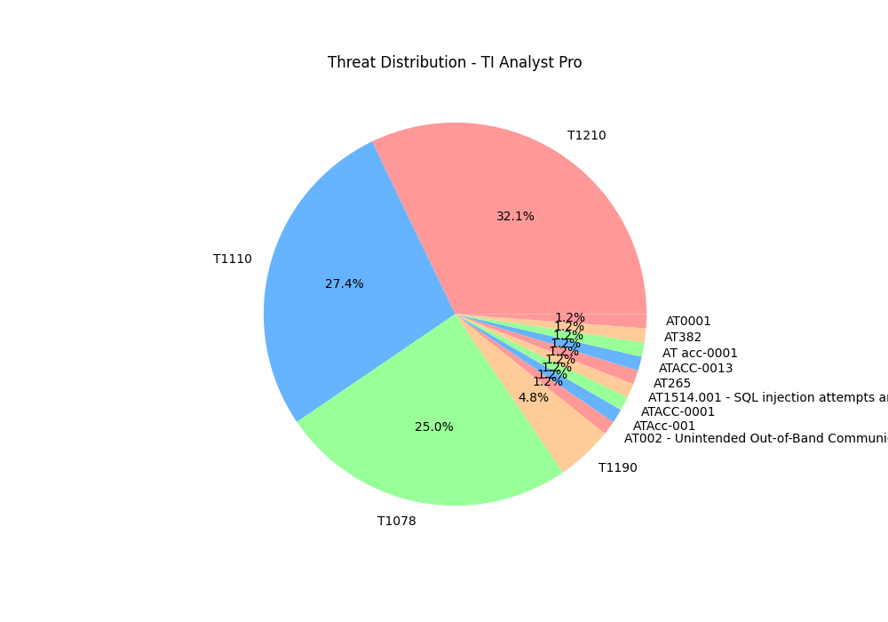

# 🛡️ TI-Analyst-Pro 
**AI-Augmented Threat Intelligence & MITRE ATT&CK Mapping System**

 


## 📖 Overview
TI-Analyst-Pro is a local SIEM (Security Information and Event Management) tool designed to ingest system logs, categorize threats using **MITRE ATT&CK** TTPs, and generate AI-driven executive summaries.

## 📊 Visualized Threat Distribution


## 🚀 Key Features
* **Automated Log Analysis**: Parses `/var/log` for unauthorized access attempts.
* **MITRE ATT&CK Mapping**: Automatically tags events with TTPs (e.g., T1210, T1110).
* **AI Summarization**: Uses Google Gemini to translate raw logs into readable security briefs.
* **Visualization**: Generates daily Matplotlib charts for high-level oversight.

## 🛠️ Installation & Usage
1. Clone the repo: `git clone https://github.com/5m3thNetw0rk/TI-Analyst-Pro.git`
2. Add your API key to a `.env` file.
3. Run the master script:
   ```bash
   ./generate_daily_brief.sh
